<style>
p.caption {
  font-size: 0.6em;
}
</style>

```{css, echo = FALSE}
.tiny .remark-code {
  font-size: .6em !important;
}
.small { font-size: 70% }
```


```{r setup, include=FALSE}
library(xaringanthemer)
style_xaringan(
  text_font_family = "Droid Serif"
)

```

# Shiny

Shiny is an R package that makes it easy to build interactive web apps. It is an <b>easy</b> but <b>powerful</b> tool for web app development.


### Advantages:
- Knowledge of HTML, CSS, or JavaScript is not required
- Rapid prototype 
- Professional appearance
- Easy customization
- R graphs capabilities
- Integration with existing pipelines


---
## Hello World!

1. First install shiny library
    ```{r install, echo = TRUE, eval = FALSE}
    install.packages("shiny")
    ```

2. Create a file called app.R
    ```{r hello, echo = TRUE, eval = FALSE}
    library(shiny) # This line loads the library
    
    ui <- fluidPage( # Creates a dynamic HTML user interface
      "Hello, world!" 
    )
    server <- function(input, output, session) {
      # The magic happens here
    }
    shinyApp(ui, server)
    ```

---
### Result

```{r, echo=FALSE, out.width="70%", fig.cap="My first shiny app.", fig.align= 'center', fig.width = 100}
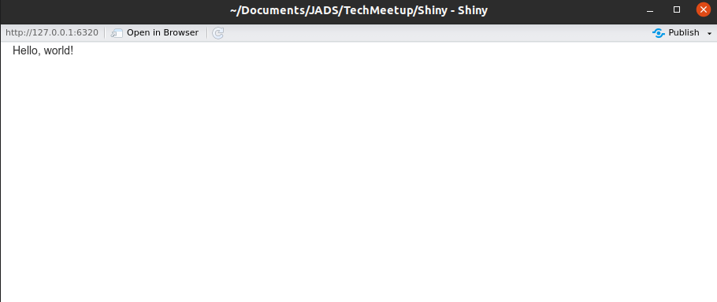
```

---
### Components: UI & Server
- User Interface (UI) section:  
        It is the HTML webpage that users will interact with (front end)

- Server section:  
        It tells shiny how the app will behave (back end)

```{r, echo=FALSE, out.width="70%", fig.align= 'center', fig.width = 100}
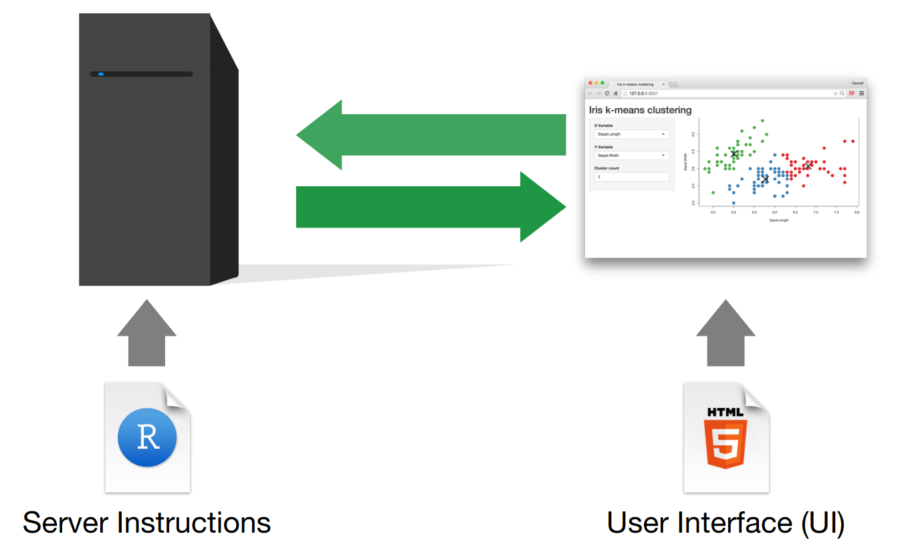
```
---
## Inputs & Outputs

* Input Controls:
        Collect values from the user and allow the user to interact
* Output Controls:
        Display information to the user such as graphs, tables or text
        
```{r, echo=FALSE, out.width="50%", fig.align= 'center', fig.width = 100}
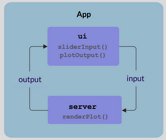
```
        
---
## Inputs

```{r, echo=FALSE, out.width="100%", fig.align= 'center', fig.width = 400}
knitr::include_graphics("images/inputs.png")
```
---
## Inputs
### Syntax
```{r, echo = TRUE, eval = FALSE}
ui <- fluidPage(
  sliderInput(
    inputId = "num", # input name
    label = "Choose a number", # label to display
    value = 25, min = 1, max = 100 # other arguments
    ) 
)

```
### Behind the scenes
```{r, echo = TRUE, eval = FALSE}
<div class="container-fluid">
  <div class="form-group shiny-input-container">
    <label class="control-label" id="num-label" for="num">Choose a number</label>
    <input class="js-range-slider" id="num" data-skin="shiny" data-min="1" data-max="100" data-from="25" data-step="1" data-grid="true" data-grid-num="9.9" data-grid-snap="false" data-prettify-separator="," data-prettify-enabled="true" data-keyboard="true" data-data-type="number"/>
  </div>
</div>
```
---
## Outputs
```{r, echo=FALSE, out.width="100%", fig.align= 'center', fig.width = 400}
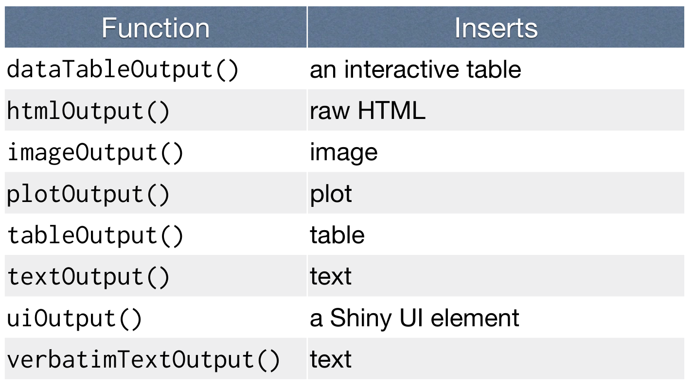
```

---
## Outputs
### Syntax
```{r, echo = TRUE, eval = FALSE}
ui <- fluidPage(
  plotOutput(
    outputId = 'hist' # output name
             )
)

```
### Behind the scenes
```{r, echo = TRUE, eval = FALSE}
<div id="hist" class="shiny-plot-output" style="width:100%;height:400px;"></div>
```
---
## Server function
It builds as a list-like object named output that contains the code to update the objects in your app

```{r, echo = TRUE, eval = FALSE}
server <- function(input, output) { 
  output$hist <- renderPlot({
    # code to build your object
  }) 
}
```

1. Save your objects to display to output$<outpudId>
2. Build objects to display with render functions
3. Access your input values with input$<inputId>

---
## Render functions

Builds reactive output to display in UI
```{r, echo=FALSE, out.width="100%", fig.align= 'center', fig.width = 400}
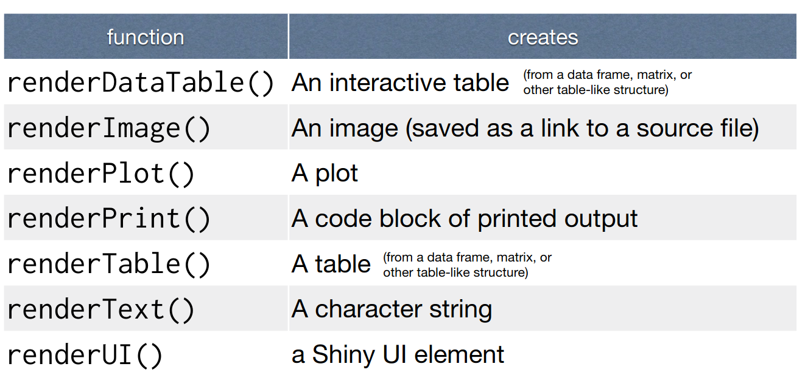
```

---
## Outputs & Render Functions
```{r, echo=FALSE, out.width="100%", fig.align= 'center', fig.width = 400}
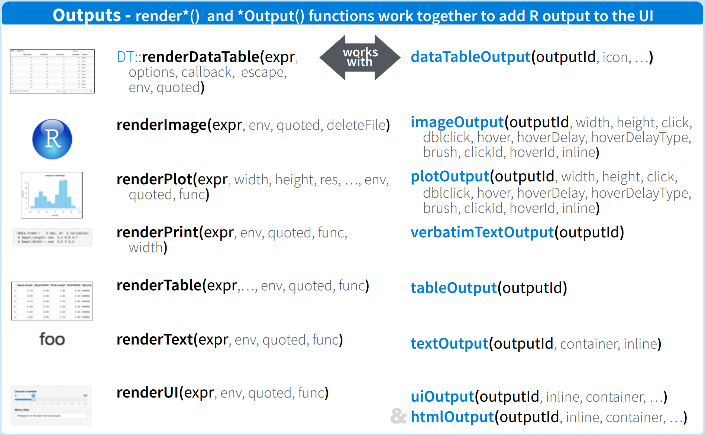
```
---
## Reactivity
When an input changes, the server will rebuild each output that depends on it (even if it is indirect).
Reactivity automatically occurs whenever you use an input value to render an output object.  

* Inputs
        - Read an input inside reactive context
        - Read-only

* Output
        - Use it with a render function (reactive context) to display 
        - Not readable
---
## Reactivity Functions
```{r, echo=FALSE, out.width="90%", fig.align= 'center', fig.width = 400}
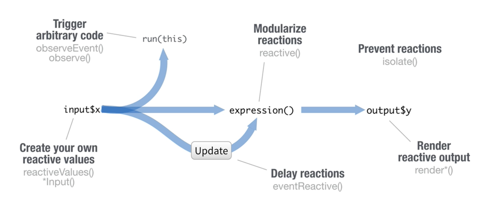
```

.small[
.pull-left[
**render*():**  
        Builds an object to display

**reactiveValues():**  
        Creates a list of reactive values whose values you can set

**isolate(**_expr_**):**   
        Run a code block and returns a non-reactive copy of the results.
]
.pull-right[
**observeEvent(**_arg1_,_arg2_**):**  
        Runs code in arg2 whenever values in arg1 changes without returning an output

**reactive(**_x_**):**  
        Creates a reactive expression that can be called by other code

**eventReactive(**_arg1_,arg2_**):**   
        Creates reactive expression with code (arg2) that only invalidates when reactive values in arg1 change
]
]


---
## Reactivity: Example
.pull-left[
```{r, echo = TRUE, eval = FALSE}
ui <- fluidPage(
  sliderInput(
    inputId = "num", 
    label = "Choose a number", 
    value = 25, 
    min = 1, 
    max = 100 
    ), 
  plotOutput(outputId = 'hist')
)

server <- function(input, output){
  output$hist <- renderPlot({
    hist(rnorm(input$num))
  })
}
shinyApp(ui, server)
```
]
.pull-right[
```{r, echo=FALSE, out.width="100%", fig.align= 'center', fig.width = 450}
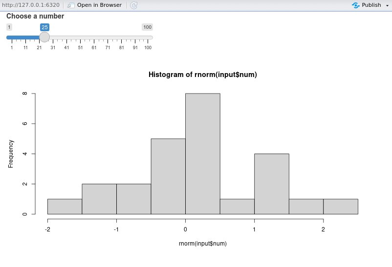
```
]
---
## Ggplot2 package

- Data visualization package for R
- Created by Hadley Wickham
- Implementation of Leland Wilkinson's Grammar of Graphics

```{r, echo=FALSE, out.width="70%", fig.align= 'center', fig.width = 450}
knitr::include_graphics("images/grammarofgraphics.png")
```

---
```{r, echo=FALSE, out.width="100%", fig.align= 'center', fig.width = 450}
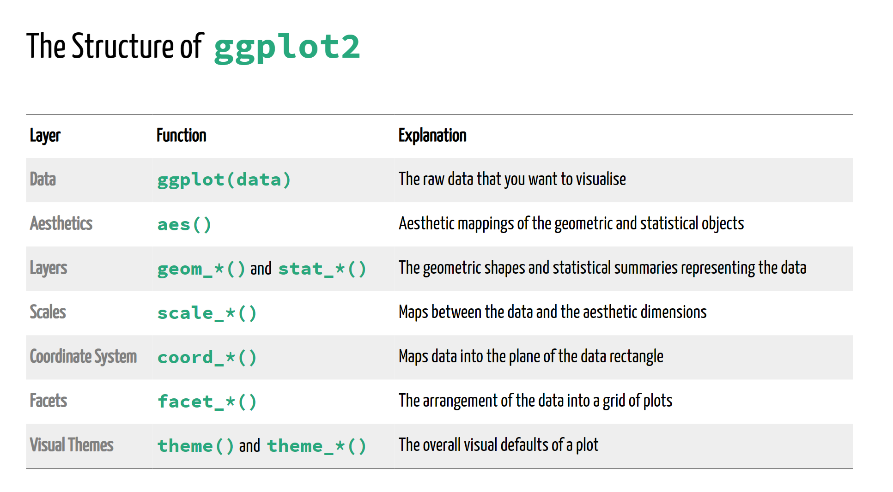
```

---
## Ggplot2: Example
.pull-left[
.tiny[
```{r, echo = TRUE, eval = FALSE}
library(ggplot2)

df <- data.frame(x = rnorm(100))

ggplot(data = df, aes(x = x)) + # Data & Aesthetics
  geom_histogram(
    aes(y =..density..), 
    bins = 9,
    fill = 'steelblue',
    color = 'white') + # Geometries
  geom_vline(
    xintercept= mean(df$x), 
    color = 'gray', 
    size = 2, linetype = 
      "dashed") +
  theme_minimal() +
  theme(
    plot.title = element_text(size = 20)) + # Theme
  ylab("Frequency") +
  xlab("X label") +
  ggtitle("Fancy plot title")
```
]
]
.pull-right[
```{r, echo=FALSE, eval = TRUE, out.height=350}
library(ggplot2)
df <- data.frame(x = rnorm(100))
ggplot(data = df, aes(x = x)) +
  geom_histogram(aes(y =..density..), bins = 9, fill = 'steelblue', color = 'white') +
  geom_vline(xintercept= mean(df$x), color = 'gray', size = 2, linetype = "dashed") +
  theme_minimal() +
  theme(plot.title = element_text(size = 30)) +
  ylab("Frequency") +
  xlab("X label") +
  ggtitle("Fancy plot title")
```
]
---
## Your turn!
Change the histogram graph in the app.

---
## Publish your app

1. Create a free account at https://www.shinyapps.io/
2. Build your Shiny app.
3. Publish your app

What you get with a free account:  
- 5 active applications
- 25 hours per month of active use

---
## Structure
Two file structure is recommended for more complex applications.   
Each app is a directory that contains:


```{r, echo=FALSE, out.width="40%", fig.align= 'center', fig.width = 400}
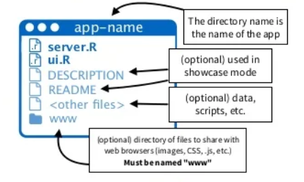
```
---
## CSS, JS & Images

1. Place the file in the www subdirectory
2. Link to it with

```{r, echo=TRUE, eval = FALSE}
# CSS:
tags$head(tags$link(rel = "stylesheet",type = "text/css", href = "<file name>"))
# JS:
tags$head(tags$script(src = "<file name>"))
# Image:
img(src="<file name>")
```

---
## Layout: fluid rows
```{r, echo=TRUE, eval = FALSE}
ui <- fluidPage(
  fluidRow(
    column(3,
           wellPanel(
             "sidebar"
           )
    ),
    column(9,
           wellPanel(
             "main"
           )
    )
  )
)
```

```{r, echo=FALSE, out.width="100%", fig.align= 'center', fig.width = 400}
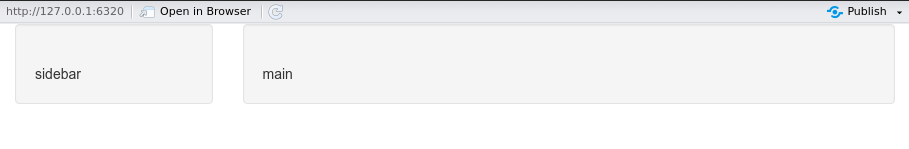
```
---
## Layout: nested fluid rows
.tiny[
```{r, echo=TRUE, eval = FALSE}
ui <- fluidPage(
  fluidRow(
    column(width = 3, #12 columns
           actionButton("click-a", "A", class = "btn-block"),
           actionButton("click-b", "B", class = "btn-block")
    ),
    column(width = 9,
           actionButton("click-c", "C", class = "btn-block")
    )
  ),
  br(),
  fluidRow(
    actionButton("click-d", "D", class = "btn-block"),
    fluidRow(
      column(width = 6,
             actionButton("click-E", "E", class = "btn-block")
      ),
      column(width = 6,
             actionButton("click-F", "F", class = "btn-block")
      )
      
    )
  )
)
```
]

```{r, echo=FALSE, out.width="100%", fig.align= 'center', fig.width = 400}
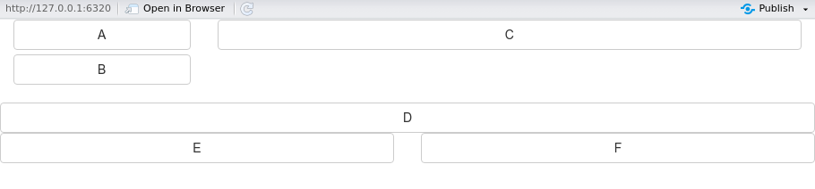
```

---
## Layout: tabsets
Tabsets allow to subdivide the user-interface into tabs.

```{r, echo=TRUE, eval = FALSE}
ui <- fluidPage(
  titlePanel("Tabsets"),
  sidebarLayout(
    sidebarPanel(
      # Inputs excluded for brevity
    ),
    mainPanel(
      tabsetPanel(
        tabPanel("Plot", plotOutput("hist")), 
        tabPanel("Summary", verbatimTextOutput("summary")), 
        tabPanel("Table", tableOutput("table"))
      )
    )
  )
)
```

```{r, echo=FALSE, out.width="100%", fig.align= 'center', fig.width = 400}
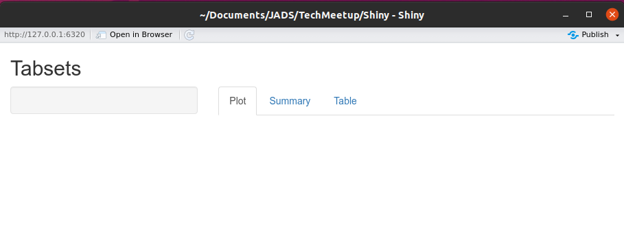
```
---
## Layout: navbarPage
The navbarPage() function creates an application with a standard Bootstrap Navbar at the top.

```{r, echo=TRUE, eval = FALSE}
ui <-  navbarPage("My Application",
  tabPanel("Component 1"),
  tabPanel("Component 2"),
  navbarMenu("More",
    tabPanel("Sub-Component A"),
    tabPanel("Sub-Component B"))
)
```

```{r, echo=FALSE, out.width="100%", fig.align= 'center', fig.width = 400}
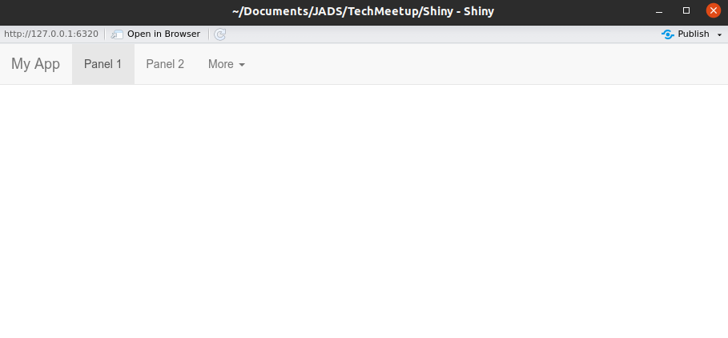
```
---
## Layout: navlists
A navlist presents the components as a sidebar list rather than using tabs.
```{r, echo=TRUE, eval = FALSE}
ui <- fluidPage(
  titlePanel("My App"),
  navlistPanel(
    "Header A",
    tabPanel("Component 1", "Output 1"),
    tabPanel("Component 2", "Output 2"),
    "Header B",
    tabPanel("Component 3")
  )
)
```

```{r, echo=FALSE, out.width="100%", fig.align= 'center', fig.width = 400}
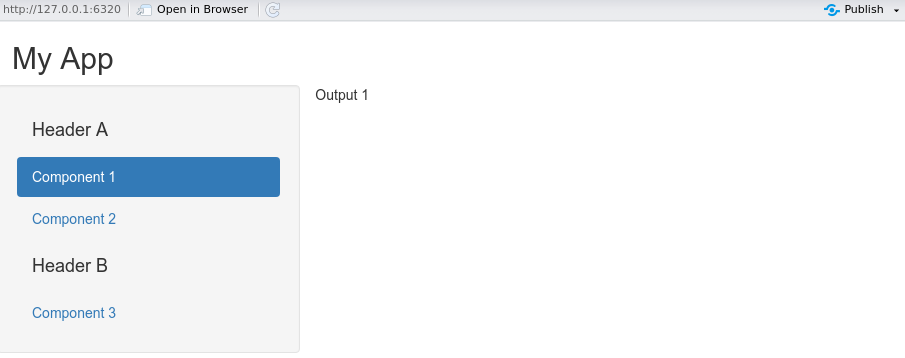
```

---
## References
.small[
Shiny (2019). https://shiny.rstudio.com/  
Shiny Cheat Sheet (2014). https://shiny.rstudio.com/images/shiny-cheatsheet.pdf  
R Shiny (2020). https://www2.stat.duke.edu/courses/Spring20/sta199.002/slides/r-shiny.html#1  
Mastering Shiny (2020). https://mastering-shiny.org/  
]